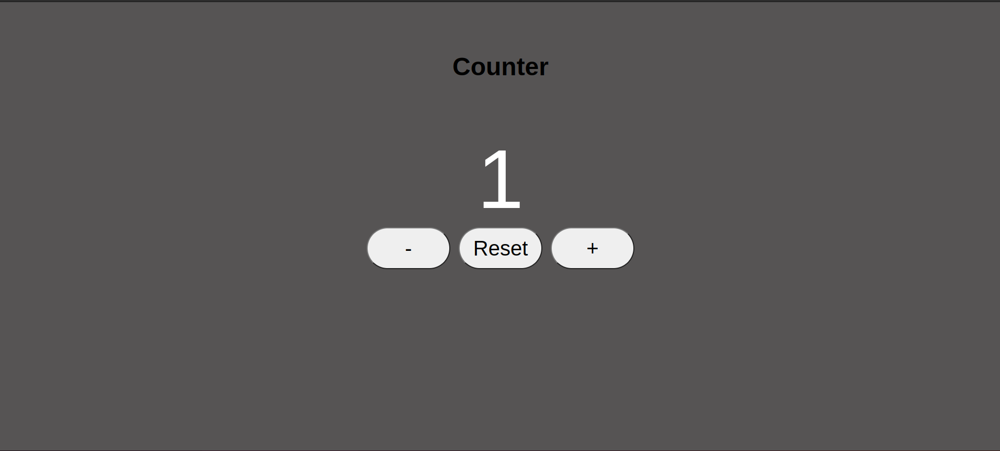

# Counter

## Project definition

> A project involves the development of an interactive counter that enables users to incrementally or decrementally count numerical values. I developed using HTML, CSS, and JavaScript with folders provided for the application of Separation of Concerns.

## Table of contents

- [Counter](#counter)
  - [Project definition](#project-definition)
  - [Table of contents](#table-of-contents)
  - [General info](#general-info)
  - [Screenshots](#screenshots)
  - [Technologies](#technologies)
  - [Setup](#setup)
  - [Code Examples](#code-examples)
  - [Features](#features)
  - [Status](#status)
  - [Inspiration](#inspiration)
  - [Contact](#contact)

## General info

## Screenshots



## Technologies

- JavaScript
- HTML5
- CSS3
- VSC code
- Jest

## Setup

1. Clone the repo from your GitHub account
   > git clone `HTTPS link`
2. Open Visual Studio Code
3. Run npm i
4. Open index.html

## Code Examples

```js
'use strict';
// Data

const data = {
  count: 0,
};

// DOM
const dom = {
  display: document.getElementById('display'),
  increment: document.getElementById('increment'),
  decrement: document.getElementById('decrement'),
  reset: document.getElementById('reset'),
};
```

## Features

List of features ready and Todos for future development

- Increment: Users can increase the count by a specified value. 
- Decrement: Users can decrease the count by a specified value. 
- Reset: Ability to reset the count to its initial value.

To-do list:

- Setup Development Environment
- Design User Interface (UI)
- Implementation of Increment Decrement Functions

## Status

Project is: completed

## Inspiration

- Technological interest 
- Creative exploration 
- Educational tools

## Contact

By [Richelle Pintucan](https://github.com/richellepintucan)
